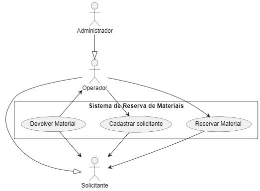
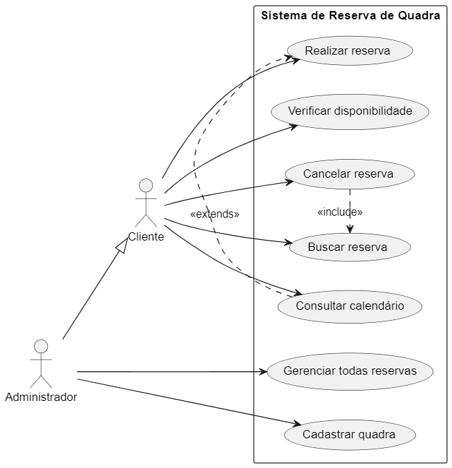
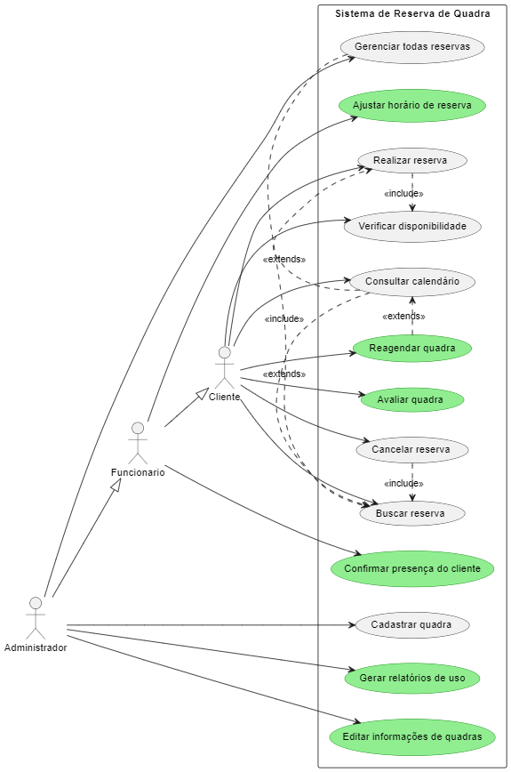

    @author Luan Gabriel
    @data   22/04/2025
    @aula   07
> ### Alto-avaliação: *Dev*

> #### _Resumo da aula_
>
> A aula de hoje marcou o incício dos estudos práticos relacionados a modelagem de diagramas. O professor escolheu utilizar o **PlantUML** para o ensino da construção dos diagramas, mas nos deu liberdade para que possamos escolher quais softwares de modalagem iremos utilizar no Estudo de Caso. Nossa equipe optou por utilizar a mesma ferramenta que o professor.
> 

---

Criei a pasta `../assets/aula07` onde irei armazenar os diagramas que construí durante essa aula.

--- 
### Diagrama 01

Diagrama que fiz apenas para testar o PlantUML e estudar o funcionamento básico.

`Código: ./assets/aulas07/diagrama01.puml`

---

### Diagrama 02

Diagrama feito pelo professor e disponibilizado no github, coloquei ele aqui apenas para ter um fácil acesso a esse exemplo.

`Código: ./assets/aulas07/diagrama02.puml`

---

### Diagrama 03

Atividade que o professor passou.

- Identifique mais 2 casos de uso para cada autor.
- Identifique mais 2 extends e 2 includes.
- Defina mais um ator diferente dos demais e defina a hierarquia.
- Aplique o que aprendeu no estudo de caso - em grupo.
- Coloque e/ou melhore o seu diário de aula.
- Faça o seu estudo de caso individual.

`Código: ./assets/aulas07/diagrama03.puml`

